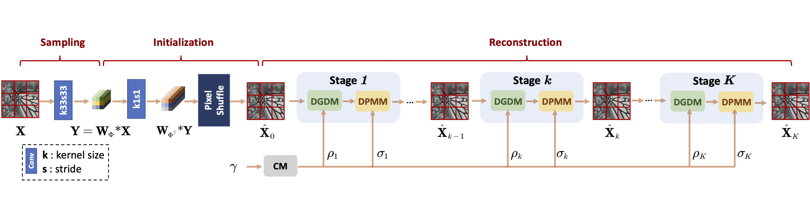
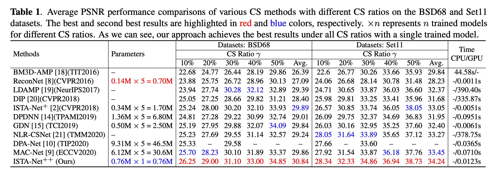

# ISTA-Net<sup>+</sup><sup>+</sup>: Flexible Deep Unfolding Network for Compressive Sensing [PyTorch]

This repository is for ISTA-Net<sup>+</sup><sup>+</sup> introduced in the following paper

Di You, Jingfen Xie (Equal Contribution), [Jian Zhang](http://jianzhang.tech/) "ISTA-Net<sup>+</sup><sup>+</sup>: Flexible Deep Unfolding Network for Compressive Sensing",  In 2021 IEEE International Conference on Multimedia and Expo (ICME), pages 1–6. IEEE, 2021. [[pdf]](https://arxiv.org/abs/2103.11554)

The code is built on **PyTorch** and tested on Ubuntu 16.04/18.04 and Windows 10 environment (Python3.x, PyTorch>=0.4) with 1080Ti GPU.

## Introduction
While deep neural networks have achieved impressive success in image compressive sensing (CS), most of them lack flexibility when dealing with multi-ratio tasks and multi-scene images in practical applications. To tackle these challenges, we propose a novel end-to-end flexible ISTA-unfolding deep network, dubbed ISTA-Net<sup>+</sup><sup>+</sup>, with superior performance and strong flexibility. Specifically, by developing a dynamic unfolding strategy, our model enjoys the adaptability of handling CS problems with different ratios, i.e., multi-ratio tasks, through a single model. A cross-block strategy is further utilized to reduce blocking artifacts and enhance the CS recovery quality. Furthermore, we adopt a balanced dataset for training, which brings more robustness when reconstructing images of multiple scenes. Extensive experiments on four datasets show that ISTA-Net<sup>+</sup><sup>+</sup> achieves state-of-the-art results in terms of both quantitative metrics and visual quality. Considering its flexibility, effectiveness and practicability, our model is expected to serve as a suitable baseline in future CS research. 

Figure 1. Illustration of the proposed ISTA-Net<sup>+</sup><sup>+</sup> framework.


## Contents
1. [Test-CS](#test-cs)
2. [Train-CS](#train-cs)
5. [Results](#results)
6. [Citation](#citation)
7. [Acknowledgements](#acknowledgements)


## Test-CS
### Quick start
1. All models for our paper have been put in './model'.
2. Please download sampling matrices from [BaiduPan [code: rgd9]](https://pan.baidu.com/s/1AFza-XCyTqRIVTdaYwjT3w).

3. Run the following scripts to test ISTA-Net<sup>+</sup><sup>+</sup> model.

    **You can use scripts in file 'TEST_ISTA_Net_pp_scripts.sh' to produce results for our paper.**

    ```bash
    # test scripts
    python TEST_ISTA_Net_pp.py  --cs_ratio 10 --layer_num 20
    python TEST_ISTA_Net_pp.py  --cs_ratio 20 --layer_num 20
    python TEST_ISTA_Net_pp.py  --cs_ratio 30 --layer_num 20
    python TEST_ISTA_Net_pp.py  --cs_ratio 40 --layer_num 20
    python TEST_ISTA_Net_pp.py  --cs_ratio 50 --layer_num 20
    ```
    

### The whole test pipeline
1. Prepare test data.

    The original test set11 is in './data'

2. Run the test scripts. 

    See **Quick start**
3. Check the results in './result'.


## Train-CS
### Prepare training data  

Trainding data: Train400
Please download it from [BaiduPan [code: 2o7t]](https://pan.baidu.com/s/1iLpTpRAwXF7Eb3aQZ0jv1A).


### Begin to train


1. run the following scripts to train .

    **You can use scripts in file 'Train_ISTA_Net_pp_scripts.sh' to train models for our paper.**

    ```bash
    # train scripts
    python Train_ISTA_Net_pp.py --layer_num 20 --learning_rate 1e-4 --start_epoch 0 --end_epoch 400 --gpu_list 0
    ```
    
    
    

## Results
### Quantitative Results



### Visual Results


## Citation
If you find the code helpful in your resarch or work, please cite the following papers.
```
@inproceedings{you2021ista,
  title={ISTA-Net++: Flexible Deep Unfolding Network for Compressive Sensing},
  author={You, Di and Xie, Jingfen and Zhang, Jian},
  booktitle={2021 IEEE International Conference on Multimedia and Expo (ICME)},
  pages={1--6},
  year={2021},
  organization={IEEE}
}
```
## Acknowledgements